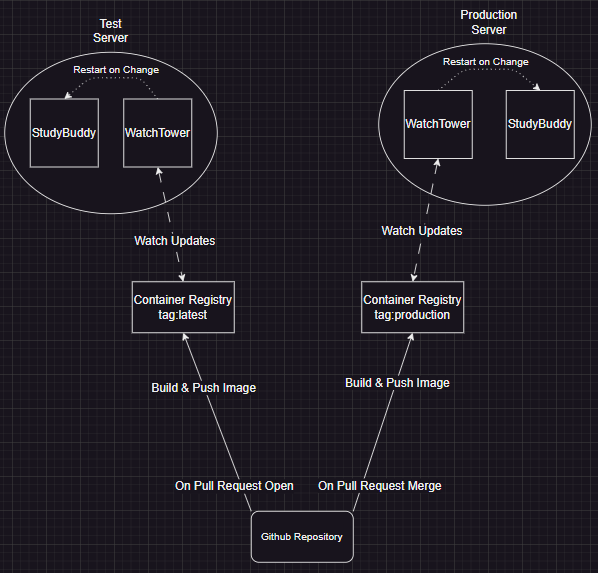

# Study Buddy Project Repository
## Project Description 
Study Buddy is an application designed to help students connect and collaborate with others for exam preparation. By finding study partners who share the same course and exam schedule, students can form study groups and enhance their learning experience.

## Mission Statement
Our vision is to provide students with an easy and efficient way to connect with each other, so they can succeed academically and feel more confident in their exam preparation.

## Core Team Members
* Bishnu Dev[-Github Account](https://github.com/bordernone)
* Lukelo Luoga [-Github Account](https://github.com/Kelo2000)
* Paula Seraphim [-Github Account](https://github.com/paulasera)

* Yewon Song [-Github Account](https://github.com/sywu430) 

## Project History
The idea for Study Buddy came from our own experiences as students. We often found ourselves struggling to find study partners who were taking the same course and preparing for the same exams. We realized that there was a need for an application that would make it easy for students to connect with each other and form study groups. So, we decided to create Study Buddy.

## Contributing
If you would like to contribute to Study Buddy, please read our [CONTRIBUTING.md](./CONTRIBUTING.md) document. We welcome all contributions, including bug reports, feature requests, and pull requests.

## Building and Testing
To run the tests, run `npm test` from back-end folder.

To build the project:
1. Ensure the `.env` files are in place
2. Run `cd front-end && npm install && npm run build && cd ..`: This will build the react app
3. Run `cd back-end && rm -r -f client && cd .. && mv front-end/build back-end/client`: This will move the react build files to the back-end folder
4. Run `cd back-end && npm install && npm start`: This will start the server

## Additional Resources

### Deployment
1. We have two versions of the app, one "dev" which is the latest version of the app containing the feature still under review.
2. We also have a "prod" version of the app which is the latest stable version of the app.

    

