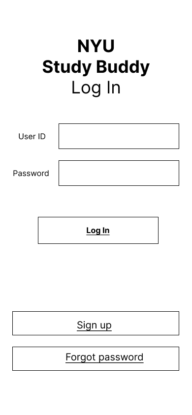

# User Experience Design

- [app map & wireframe instructions](instructions-0a-app-map-wireframes.md).
- [prototype instructions](https://www.figma.com/file/wVFoFJo4pReM8SOfSvbafv/App-Map-%26-Wireframe-(Copy)?node-id=0%3A1&t=saCZ0RIp4IKdVusd-1)

### Wireframes

# App map 

    

# Wireframe diagrams

## Log-in screen: 
When we access the application, the first thing we see is a log-in screen.

    

## Sign-up screen: 
If the user does not have the account yet, one has to sign up.

    

## Finding Password screen: 
If the user forgets the password, the user would be navigated to the finding password screen and then the user have to fill out user id and the email. 

    

## Reset Password screen
After filling out the user id and email, the user is re-setting the password.

    

## Home screen
This screen will take the user at the homepage screen of the app where the User can navigate to other pages such as my profile, message chat, search or uploading post. 

    

## My Profile screen
This screen will show the profile of the user with information such as the User's name and Major. Also, this screen will show the preview of all the post made by the user in the app. 

    

## Message Chat
This screen will show all the messages in specific chat that the user is involved. 

    

## Message List
This screen will show all the messages chats for the messages received or sent by the user.

    

## Other User's Profile
This screen will allow the User to view the information of other User of the app

    

## Upload Post
This screen will allow the user to upload post as a process of recruiting study buddy. They will enter information such as the date, subject

    

## Filtered screen
This screen will allow the user to apply filters that will help them to find relevant post matching their criteria as the process of finding study buddy. 

    

## View Post
This screen will allow the user to view the details of the post such as the date, subject and comments on the post. The user will also be able to enter the comment on the post so as to be able to join with the other study buddy.  

    

